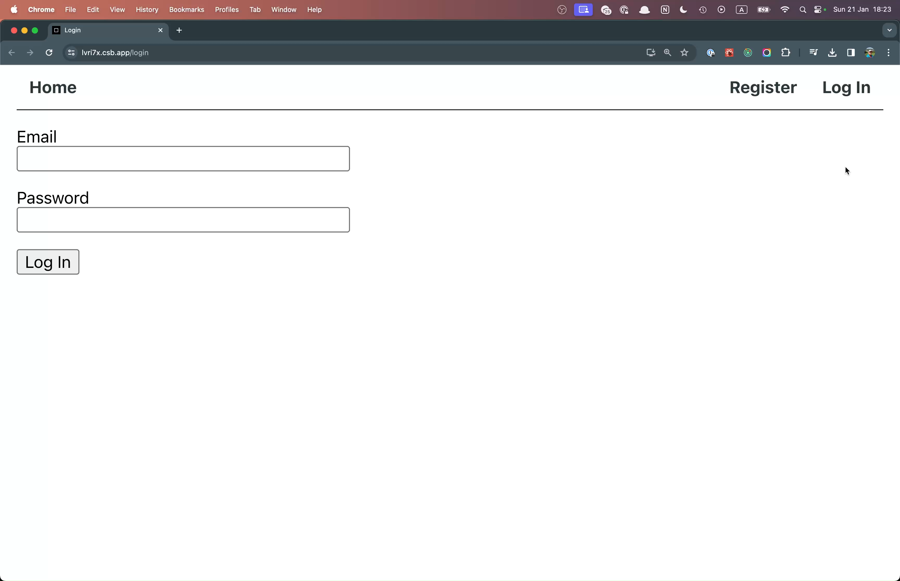
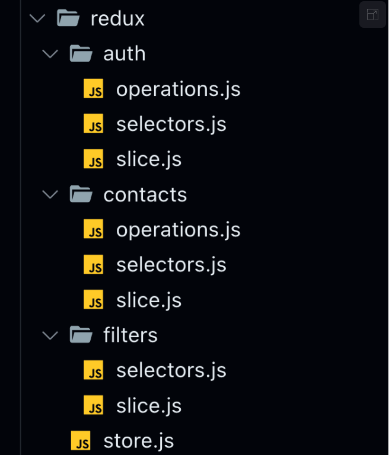

# Книга контактів `goit-react-hw-08`

Додайте у застосунок «Книга контактів» із домашнього завдання попереднього модуля можливість реєстрації та логіна, а також роботу з приватною колекцією контактів. Використовуйте застосунок "Планувальник завдань" з матеріалів, як приклад.



**Бекенд**

Для цього завдання є готовий бекенд з [документацією](https://connections-api.goit.global/docs/). Використовуй його замість твого бекенда створеного через сервіс **mockapi.io**.

```
https://connections-api.goit.global/
```

Він підтримує всі необхідні операції з колекцією контактів, а також реєстрацію, логін та оновлення користувача за допомогою JWT.

**Структура папок Redux**

У Redux буде три слайси. Вже реалізовані вами **contacts** та **filters**, а також новий — **auth**, який буде відповідати за стан користувача. Під кожен слайс створіть окрему папку і файли під такі сутності як операції, селектори та логіку слайсу.
У вас має вийти наступна структура:


Перенесіть код з файлів `contactsSlice.js`, `contactsOps.js`, `filtersSlice.js` у нові відповідні файли.

**Слайс auth**

Додайте у Redux новий стан auth наступної структури:

```js
{
  user: {
    name: null,
    email: null,
  },
  token: null,
  isLoggedIn: false,
  isRefreshing: false,
}
```

**Операції слайсу auth**

Додайте у файл `redux/auth/operations.js` операції, оголошені за допомогою **createAsyncThunk**, для роботи з користувачем:

- `register` - для реєстрації нового користувача. Базовий тип екшену "auth/register". Використовується у компоненті RegistrationForm на сторінці реєстрації.
- `login` - для логіну існуючого користувача. Базовий тип екшену "auth/login". Використовується у компоненті LoginForm на сторінці логіну.
- `logout` - для виходу з додатка. Базовий тип екшену "auth/logout". Використовується у компоненті UserMenu у шапці додатку.
- `refreshUser` - оновлення користувача за токеном. Базовий тип екшену "auth/refresh". Використовується у компоненті App під час його монтування.

Токен авторизованого користувача потрібно зберігати в локальному сховищі за допомогою бібліотеки [persist](https://github.com/rt2zz/redux-persist#readme).

**Маршрутизація**

Додайте маршрутизацію з бібліотекою React Router. Компоненти сторінок додайте у папку `src/pages`. Для обгортки компонентів публічних і приватних сторінок використовуйте компоненти **PrivateRoute** та **RestrictedRoute**.

У застосунку мають бути наступні маршрути:

- **/ **- маршрут домашньої сторінки додатка, де можна розмістити інформацію про додаток чи його розробника. Рендерить компонент HomePage.
- **/register** - публічний маршрут для реєстрації нового користувача, на якому рендериться компонент сторінки RegistrationPage з формою RegistrationForm.
- **/login** - публічний маршрут для логіна існуючого користувача, на якому рендериться компонент сторінки LoginPage з формою LoginForm.
-  **/contacts** - приватний маршрут для роботи зі списком контактів користувача, на якому рендериться компонент сторінки ContactsPage.

Створіть компонент Layout, який буде рендерити компонент AppBar і огортати усі маршрути, щоб бути доступним на кожному із них.

Компонент AppBar має рендерити компонент навігації Navigation та AuthNav. Водночас авторизований користувач замість AuthNav має бачити UserMenu.

Обов’язково очищайте колекцію контактів у стані при логауті користувача

При перезавантаженні сторінки /contacts необхідно забезпечити збереження статусу авторизації користувача. Це означає, що система повинна автоматично відновлювати авторизований стан користувача без необхідності повторного введення логіна та пароля.

**Форми**

Для форм входу (**LoginForm**) та реєстрації (**RegistrationForm**) краще використовувати бібліотеку [Formik](https://formik.org/).

**Додатково**

Це фінальна версія застосунку, тому підходьте до завдання відповідально. Ось список ідей необов'язкових доповнень, які можуть бути в застосунку:
- При введенні у текстове поле пошуку контактів фільтрація виконується не лише за ім'ям, але й за номером телефону.
- При видаленні контакту необхідно підтверджувати операцію через модальне вікно.
- При успішних операціях додавання та видалення контакту користувачу відображається повідомлення за допомогою [React Hot Toast](https://react-hot-toast.com/).
- Контакти можна редагувати, бекенд підтримує PATCH-запит для оновлення контакту.
- Для стилізації можна використовувати бібліотеку компонентів, наприклад [Material UI](https://mui.com/material-ui/).
